# FinTrack - Complete User Flow Documentation

## Overview
FinTrack is a comprehensive personal finance management mobile application built with React Native and Expo. It helps users track accounts, transactions, budgets, goals, bills, and liabilities in one unified platform.

---

## 1. Authentication Flow

### Sign Up Flow
1. **Splash Screen** → App launches, checks authentication status
2. **Sign Up Screen**:
   - User enters: First Name, Last Name, Email, Phone (optional), Password, Confirm Password
   - Accepts Terms & Conditions
   - Option for Social Sign Up (Google/Apple) - placeholder
   - Validates: All fields required, passwords match, minimum 8 characters
   - On success → Navigate to **Account Setup**

### Sign In Flow
1. **Splash Screen** → If not authenticated → **Sign In Screen**
2. **Sign In Screen**:
   - User enters: Email, Password
   - Forgot Password functionality
   - Option for Social Sign In (Google/Apple) - placeholder
   - On success → Navigate to **Home Dashboard (Tabs)**

### Account Setup Flow (First Time Users)
1. **Step 1: Add Accounts**
   - Select account type: Checking, Savings, Credit Card, Investment, Cash, Loan
   - Enter account name
   - Choose color and icon
   - Add multiple accounts

2. **Step 2: Set Balances**
   - Enter current balance for each added account
   - Select currency for each account
   - Remove accounts if needed

3. **Step 3: Review & Complete**
   - Review all accounts with balances
   - View total balance summary
   - Complete setup → Navigate to **Onboarding** or **Home Dashboard**

### Onboarding Flow (Optional)
1. **Financial Overview**: Enter monthly income and expenses
2. **Financial Goals**: Select goals (Emergency Fund, Retirement, House, Education, Travel, Debt)
3. **Investment Profile**: Choose experience level (Beginner/Intermediate/Advanced) and risk tolerance (Conservative/Moderate/Aggressive)
4. **Preferences**: Select notification preferences (Transactions, Budgets, Goals, Bills, Market, Security)
5. **Complete** → Navigate to **Home Dashboard**

---

## 2. Home Dashboard (Main Tab)

### Features
- **Welcome Section**: Personalized greeting with profile/settings access
- **Current Balance Card**: Total balance across all accounts
- **Quick Actions**: 
  - Receive Money (Income transaction)
  - Pay Money (Expense transaction)
  - Transfer Money (Between accounts)
- **Accounts List**: All user accounts with balances
  - Tap account → **Account Detail Screen**
  - Add Account button → **Add Account Modal**
- **Bills Alerts**: 
  - Overdue bills (red alert)
  - Due today (yellow alert)
  - Upcoming this week (blue alert)
  - Tap "View All" → **Bills Tab**

### Navigation
- Bottom tab navigation with 9 tabs: Home, Accounts, Analytics, Bills, Transactions, Goals, Budgets, Liabilities, Categories

---

## 3. Accounts Tab

### Features
- **Header**: "Your Accounts" title with Add Account button
- **Total Balance Card**: Aggregated balance display
- **Accounts List**: 
  - All accounts displayed as cards
  - Special handling for "Goals Savings Account" (trophy icon)
  - Shows account name, type, balance
  - Displays liability funds vs own funds breakdown
  - Tap account → **Account Detail Screen**
- **Quick Actions**:
  - Add Account → **Add Account Modal**
  - Transfer → Navigate to Transactions tab

### Account Detail Screen (`/account/[id]`)
- **Header**: Account name, type, and balance
- **Tabs**: Transactions, Goals, Budgets
- **Account Breakdown**: Shows liability funds and own funds if applicable
- **Quick Actions**: Receive, Pay, Transfer modals
- **Transactions Tab**: Filtered transactions for this account
- **Goals Tab**: Goals linked to this account
- **Budgets Tab**: Budgets linked to this account

---

## 4. Transactions Tab

### Features
- **View Modes**: 
  - **List View**: All transactions in chronological order
  - **Calendar View**: Transactions plotted on calendar with color coding
    - Income: Green dots
    - Expense: Red dots
    - Transfer: Blue dots
- **Filters**:
  - Transaction Type: All, Income, Expense, Transfer
  - Date Filter: Select date from calendar to view specific day's transactions
- **Transaction Cards**: 
  - Show: Amount, Category, Description, Date, Account
  - Color coded by type
  - Tap transaction → **Transaction Detail Screen**
- **Quick Actions**: Receive, Pay, Transfer buttons at bottom
- **Empty State**: Prompts to add first transaction

### Transaction Detail Screen (`/transaction/[id]`)
- Full transaction details
- Edit transaction capability
- View related account and category

---

## 5. Budgets Tab

### Features
- **Tabs**: Active Budgets / Completed Budgets
- **Budget Cards**: 
  - Budget name, category, period
  - Spent amount vs Total amount
  - Progress bar with percentage
  - Status indicators
  - Tap budget → **Budget Detail Screen**
- **Add Budget Button**: Opens **Add Budget Modal**
- **Empty State**: Prompts to create first budget

### Budget Detail Screen (`/budget/[id]`)
- Full budget details
- Spending breakdown
- Timeline and progress tracking
- Associated transactions

### Add Budget Modal
1. **Select Budget Type**: Category-based, Goal-based, Account-based, Custom
2. **Configure Details**:
   - Name, Amount, Start/End dates
   - Recurrence pattern (Monthly, Weekly, Yearly, Custom)
   - Category or Goal selection
   - Account selection (if applicable)
   - Alert thresholds
   - Rollover settings
3. **Review & Create**

---

## 6. Goals Tab

### Features
- **Tabs**: Active Goals / Completed Goals
- **Goal Cards**:
  - Goal name, target amount, current amount
  - Progress bar and percentage
  - Deadline date
  - Tap goal → **Goal Detail Screen**
- **Add Goal Button**: Opens **Add Goal Modal**
- **Empty State**: Prompts to create first goal

### Goal Detail Screen (`/goal/[id]`)
- Full goal details
- Contribution history
- Progress visualization
- Extend goal option
- Withdraw funds option
- Celebration screen on completion

### Add Goal Modal
1. **Enter Goal Details**:
   - Goal name
   - Target amount
   - Deadline date
   - Goal type (Savings, Purchase, Debt payoff, etc.)
   - Linked account (Goals Savings Account)
2. **Review & Create**

---

## 7. Bills Tab

### Features
- **Filter Tabs**: All, Upcoming, Due Today, Overdue, Paid
  - Each tab shows count badge
- **Summary Cards**: 
  - Upcoming amount total
  - Overdue amount total
  - Due today count
- **Bill Cards**:
  - Bill name, category, due date
  - Amount (or "Variable")
  - Status badge (color coded)
  - Quick actions for unpaid bills:
    - Pay Bill → **Mark Bill Paid Modal**
    - Postpone → **Postpone Bill Modal**
  - Tap bill → **Bill Detail Screen**
- **Quick Actions**: Add Bill, Manage Categories

### Bill Detail Screen (`/bill/[id]`)
- Full bill details
- Payment history
- Recurrence information
- Edit/Delete options

### Add Bill Modal
1. **Basic Information**:
   - Title, Description, Amount
   - Category selection
   - Color and icon customization
2. **Recurrence Settings**:
   - Bill type: One-time or Recurring
   - Recurrence pattern (Monthly, Weekly, etc.)
   - Due date
   - End date (optional)
3. **Additional Settings**:
   - Goal linkage
   - Account linkage
   - Reminder days before due date
   - Notes
4. **Review & Create**

---

## 8. Liabilities Tab

### Features
- **View Tabs**: Upcoming Payments / All Liabilities
- **Upcoming View**:
  - Shows active liabilities with upcoming due dates
  - Days until due badge
  - Due date highlighted
  - Sorted by due date
- **All View**:
  - All liabilities regardless of status
  - Progress bar showing pay-off percentage
  - Status badge (Active, Paid Off, Overdue, Paused)
  - Shows original amount vs current balance
  - Disbursed amount (if applicable)
  - Interest rate (APR) if available
- **Liability Cards**:
  - Liability name, type
  - Current balance, original amount
  - Progress visualization
  - Tap liability → **Liability Detail Screen**
- **Add Liability Button**: Opens **Add Liability Modal**

### Liability Detail Screen (`/liability/[id]`)
- Full liability details
- Payment history
- Interest calculations
- Pay liability option
- Convert to asset option (if applicable)

### Add Liability Modal
1. **Liability Information**:
   - Title, Type (Credit Card, Personal Loan, Mortgage, etc.)
   - Original amount
   - Current balance
   - Interest rate (APR)
   - Start date
2. **Payment Settings**:
   - Periodical payment amount
   - Next due date
   - Payment frequency
3. **Account Linkage**: Link to specific account
4. **Review & Create**

---

## 9. Categories Tab

### Features
- **Search Bar**: Search categories by name
- **Activity Type Filters**: 
  - All, Income, Expense, Goal, Bill, Liability, Budget
- **Summary Cards**: 
  - Total categories count
  - Active categories count
- **Top Categories Section**:
  - Most Spent category
  - Most Received category
  - Most Saved category
  - Shows amount and percentage of total
- **Categories List**:
  - Category name, icon, color
  - Activity type badges
  - Statistics: Spent, Received, Transaction count
  - Tap category → **Category Detail Screen**
- **Add Category Button**: Opens **Add Category Modal**

### Category Detail Screen (`/category/[id]`)
- Full category details
- Transaction history
- Spending/receiving trends
- Edit/Delete options

### Add Category Modal
1. **Category Information**:
   - Category name
   - Activity types (can select multiple)
   - Icon selection
   - Color selection
2. **Review & Create**

---

## 10. Analytics Tab

### Features
- **Period Selector**: Week, Month, Year
- **Key Stats Cards**:
  - Total Income (with % change)
  - Total Expenses (with % change)
  - Net Savings (with % change)
  - Savings Rate (with % change)
- **Charts**:
  - Expense Trend: Bar chart showing expenses over time
  - Income vs Expenses: Comparison bars
  - Expense Categories: List showing category breakdown with percentages
- **Insights Section**:
  - Automated insights about spending patterns
  - Budget warnings
  - Goal progress updates
  - Savings rate improvements

---

## 11. Profile Screen

### Features
- **Profile Header**:
  - Avatar with edit option
  - User name and email
  - Member since date
  - Edit Profile button
- **Financial Overview**:
  - Total Balance
  - Monthly Income
  - Monthly Expenses
  - Savings Rate
- **Quick Stats**:
  - Accounts count
  - Goals count
  - Budgets count
  - Credit Score (placeholder)
- **Quick Actions**:
  - Settings
  - Help & Support
  - Reports
  - Share App
- **Preferences**:
  - Push Notifications toggle
  - Biometric Login toggle
  - Dark Mode toggle
- **Sign Out Button**

---

## 12. Settings Screen

### Features
- **Profile Section**:
  - User info display
  - Edit profile option
- **Appearance Settings**:
  - Background Mode toggle (Moss Green / iOS Gradient)
  - Dark Mode toggle
- **Currency Settings**:
  - Default currency selector (20+ currencies)
  - Currency preview (shows formatted amount)
- **Notification Settings**:
  - Push Notifications toggle
  - Biometric Login toggle
- **Account Settings**:
  - Edit Profile
  - Privacy & Security
  - Help & Support
- **Sign Out Button**

---

## 13. Transaction Modals

### Pay Modal (Expense Transaction)
1. **Enter Details**:
   - Amount
   - Description
   - Category (expense categories)
   - Account selection
   - Date
2. **Liability Options** (if applicable):
   - Pay from account or liability
   - Transfer to liability option
   - Convert liability funds to personal
3. **Submit** → Creates expense transaction

### Receive Modal (Income Transaction)
1. **Enter Details**:
   - Amount
   - Description
   - Category (income categories)
   - Account selection
   - Date
2. **Submit** → Creates income transaction

### Transfer Modal
1. **Transfer Type**:
   - Between Accounts
   - Liability to Personal
2. **Enter Details**:
   - From Account/Liability
   - To Account
   - Amount
   - Description
   - Date
3. **Submit** → Creates transfer transaction

---

## 14. Common Patterns

### Modal Workflow
- Most modals follow: Open → Fill Form → Validate → Submit → Close → Refresh Data
- Success notifications appear after operations
- Data refreshes automatically across all tabs

### Navigation Patterns
- **Bottom Tab Navigation**: Primary navigation between main features
- **Stack Navigation**: Detail screens (account/[id], transaction/[id], etc.)
- **Modal Presentation**: Forms and quick actions

### Data Refresh
- Global refresh mechanism updates all data
- Real-time subscriptions for live updates
- Pull-to-refresh on list screens

### Empty States
- All list screens have helpful empty states
- Empty states include action buttons to create first item
- Guidance text explains what to do next

---

## 15. Key User Journeys

### Journey 1: First Time User Setup
1. Launch app → Splash screen
2. Sign Up → Create account
3. Account Setup → Add initial accounts with balances
4. Onboarding (optional) → Set preferences
5. Home Dashboard → Start using app

### Journey 2: Daily Expense Tracking
1. Home → Quick Actions → Pay
2. Pay Modal → Enter expense details
3. Transaction recorded → Account balance updated
4. View in Transactions tab
5. Check Analytics for spending insights

### Journey 3: Bill Management
1. Bills Tab → View upcoming/overdue bills
2. Add Bill → Set up recurring bill
3. Receive notification before due date
4. Pay Bill → Mark as paid from bill detail
5. Bill status updated → Reflects in bills list

### Journey 4: Goal Saving
1. Goals Tab → Add Goal
2. Set target amount and deadline
3. Make contributions → Receive money into Goals Savings Account
4. Allocate to goal
5. Track progress → Celebrate on completion

### Journey 5: Budget Planning
1. Budgets Tab → Add Budget
2. Select category or goal-based budget
3. Set amount and period
4. Track spending → Get alerts at thresholds
5. Review analytics → Adjust budget

### Journey 6: Liability Management
1. Liabilities Tab → Add Liability
2. Enter loan/credit card details
3. View upcoming payments
4. Pay Liability → Reduce balance
5. Track payoff progress

---

## 16. Technical Implementation Notes

### Context Providers
- `AuthContext`: User authentication state
- `UserContext`: User profile data
- `SettingsContext`: App preferences (currency, notifications, etc.)
- `BackgroundModeContext`: UI theme/background preferences
- `NotificationContext`: In-app notifications
- `LiabilitiesContext`: Liability management logic

### Data Management
- Supabase for backend database
- Real-time subscriptions for live updates
- `useRealtimeData` hook for data fetching
- Optimistic UI updates

### UI Components
- Glassmorphism design theme
- Custom card components
- Modal system for forms
- Calendar integration
- Chart visualizations (simplified)

---

## Visual Flowchart

```mermaid
flowchart TD
    Start([App Launch]) --> Splash{Splash Screen}
    Splash -->|Authenticated| HomeTab[Home Dashboard]
    Splash -->|Not Authenticated| SignIn[Sign In Screen]
    
    SignIn -->|New User| SignUp[Sign Up Screen]
    SignIn -->|Success| HomeTab
    SignUp -->|Success| AccountSetup[Account Setup]
    
    AccountSetup --> Step1[Step 1: Add Accounts]
    Step1 --> Step2[Step 2: Set Balances]
    Step2 --> Step3[Step 3: Review]
    Step3 --> Onboarding{Onboarding?}
    Onboarding -->|Yes| OnboardFlow[Onboarding Steps]
    Onboarding -->|No| HomeTab
    OnboardFlow --> HomeTab
    
    HomeTab --> TabNav{Bottom Tab Navigation}
    
    TabNav -->|Home| HomeTab
    TabNav -->|Accounts| AccountsTab[Accounts Tab]
    TabNav -->|Transactions| TransactionsTab[Transactions Tab]
    TabNav -->|Budgets| BudgetsTab[Budgets Tab]
    TabNav -->|Goals| GoalsTab[Goals Tab]
    TabNav -->|Bills| BillsTab[Bills Tab]
    TabNav -->|Liabilities| LiabilitiesTab[Liabilities Tab]
    TabNav -->|Categories| CategoriesTab[Categories Tab]
    TabNav -->|Analytics| AnalyticsTab[Analytics Tab]
    
    %% Home Tab Actions
    HomeTab --> ReceiveModal[Receive Money Modal]
    HomeTab --> PayModal[Pay Money Modal]
    HomeTab --> TransferModal[Transfer Modal]
    HomeTab --> AddAccountModal[Add Account Modal]
    HomeTab --> AccountDetail[Account Detail Screen]
    HomeTab --> BillsTab
    
    %% Accounts Tab
    AccountsTab --> AccountDetail
    AccountsTab --> AddAccountModal
    AccountsTab --> TransactionsTab
    
    %% Account Detail Screen
    AccountDetail --> AccountTabs{Account Tabs}
    AccountTabs -->|Transactions| AccountTrans[Account Transactions]
    AccountTabs -->|Goals| AccountGoals[Account Goals]
    AccountTabs -->|Budgets| AccountBudgets[Account Budgets]
    AccountDetail --> ReceiveModal
    AccountDetail --> PayModal
    AccountDetail --> TransferModal
    
    %% Transactions Tab
    TransactionsTab --> ViewMode{View Mode}
    ViewMode -->|List| TransactionList[Transaction List]
    ViewMode -->|Calendar| CalendarView[Calendar View]
    TransactionsTab --> TransactionFilter[Filter by Type]
    TransactionsTab --> TransactionDetail[Transaction Detail Screen]
    TransactionsTab --> ReceiveModal
    TransactionsTab --> PayModal
    TransactionsTab --> TransferModal
    
    %% Budgets Tab
    BudgetsTab --> BudgetTabs{Budget Tabs}
    BudgetTabs -->|Active| ActiveBudgets[Active Budgets]
    BudgetTabs -->|Completed| CompletedBudgets[Completed Budgets]
    BudgetsTab --> AddBudgetModal[Add Budget Modal]
    BudgetsTab --> BudgetDetail[Budget Detail Screen]
    
    AddBudgetModal --> BudgetType{Select Type}
    BudgetType -->|Category| CategoryBudget[Category Budget]
    BudgetType -->|Goal| GoalBudget[Goal Budget]
    BudgetType -->|Account| AccountBudget[Account Budget]
    
    %% Goals Tab
    GoalsTab --> GoalTabs{Goal Tabs}
    GoalTabs -->|Active| ActiveGoals[Active Goals]
    GoalTabs -->|Completed| CompletedGoals[Completed Goals]
    GoalsTab --> AddGoalModal[Add Goal Modal]
    GoalsTab --> GoalDetail[Goal Detail Screen]
    
    GoalDetail --> ContributeModal[Contribute to Goal]
    GoalDetail --> WithdrawModal[Withdraw from Goal]
    GoalDetail --> ExtendGoal[Extend Goal Deadline]
    GoalDetail --> GoalComplete{Goal Complete?}
    GoalComplete -->|Yes| Celebration[Goal Celebration Screen]
    
    %% Bills Tab
    BillsTab --> BillFilters{Bill Filters}
    BillFilters -->|All| AllBills[All Bills]
    BillFilters -->|Upcoming| UpcomingBills[Upcoming Bills]
    BillFilters -->|Due Today| DueTodayBills[Due Today]
    BillFilters -->|Overdue| OverdueBills[Overdue Bills]
    BillFilters -->|Paid| PaidBills[Paid Bills]
    
    BillsTab --> AddBillModal[Add Bill Modal]
    BillsTab --> BillDetail[Bill Detail Screen]
    BillDetail --> MarkPaidModal[Mark Bill Paid Modal]
    BillDetail --> PostponeModal[Postpone Bill Modal]
    
    AddBillModal --> BillType{Bill Type}
    BillType -->|One-time| OneTimeBill[One-time Bill]
    BillType -->|Recurring| RecurringBill[Recurring Bill Setup]
    
    %% Liabilities Tab
    LiabilitiesTab --> LiabilityViews{Liability Views}
    LiabilityViews -->|Upcoming| UpcomingLiabilities[Upcoming Payments]
    LiabilityViews -->|All| AllLiabilities[All Liabilities]
    
    LiabilitiesTab --> AddLiabilityModal[Add Liability Modal]
    LiabilitiesTab --> LiabilityDetail[Liability Detail Screen]
    LiabilityDetail --> PayLiabilityModal[Pay Liability Modal]
    LiabilityDetail --> ConvertModal[Convert to Asset]
    
    %% Categories Tab
    CategoriesTab --> CategorySearch[Search Categories]
    CategoriesTab --> CategoryFilters[Filter by Activity Type]
    CategoriesTab --> CategoryDetail[Category Detail Screen]
    CategoriesTab --> AddCategoryModal[Add Category Modal]
    
    %% Analytics Tab
    AnalyticsTab --> PeriodSelect{Period Selector}
    PeriodSelect -->|Week| WeekAnalytics[Week Analytics]
    PeriodSelect -->|Month| MonthAnalytics[Month Analytics]
    PeriodSelect -->|Year| YearAnalytics[Year Analytics]
    
    AnalyticsTab --> StatsCards[Key Stats Cards]
    AnalyticsTab --> Charts[Charts & Visualizations]
    AnalyticsTab --> Insights[Insights Section]
    
    %% Profile & Settings
    HomeTab --> ProfileScreen[Profile Screen]
    ProfileScreen --> SettingsScreen[Settings Screen]
    
    SettingsScreen --> CurrencyModal[Currency Selection]
    SettingsScreen --> AppearanceSettings[Appearance Settings]
    SettingsScreen --> NotificationSettings[Notification Settings]
    SettingsScreen --> AccountSettings[Account Settings]
    
    %% Transaction Modals Flow
    PayModal --> PayForm[Enter Expense Details]
    PayForm --> PayValidation{Validate}
    PayValidation -->|Valid| PaySubmit[Submit Expense]
    PayValidation -->|Invalid| PayForm
    PaySubmit --> PaySuccess[Transaction Created]
    
    ReceiveModal --> ReceiveForm[Enter Income Details]
    ReceiveForm --> ReceiveValidation{Validate}
    ReceiveValidation -->|Valid| ReceiveSubmit[Submit Income]
    ReceiveValidation -->|Invalid| ReceiveForm
    ReceiveSubmit --> ReceiveSuccess[Transaction Created]
    
    TransferModal --> TransferForm[Enter Transfer Details]
    TransferForm --> TransferValidation{Validate}
    TransferValidation -->|Valid| TransferSubmit[Submit Transfer]
    TransferValidation -->|Invalid| TransferForm
    TransferSubmit --> TransferSuccess[Transaction Created]
    
    %% Data Refresh
    PaySuccess --> RefreshData[Refresh All Data]
    ReceiveSuccess --> RefreshData
    TransferSuccess --> RefreshData
    AddAccountModal --> RefreshData
    AddBudgetModal --> RefreshData
    AddGoalModal --> RefreshData
    AddBillModal --> RefreshData
    AddLiabilityModal --> RefreshData
    AddCategoryModal --> RefreshData
    
    RefreshData --> HomeTab
    
    %% Styling
    classDef startEnd fill:#10B981,stroke:#000,stroke-width:3px,color:#fff
    classDef screen fill:#3B82F6,stroke:#000,stroke-width:2px,color:#fff
    classDef modal fill:#F59E0B,stroke:#000,stroke-width:2px,color:#fff
    classDef decision fill:#8B5CF6,stroke:#000,stroke-width:2px,color:#fff
    classDef success fill:#10B981,stroke:#000,stroke-width:2px,color:#fff
    
    class Start,Splash,HomeTab startEnd
    class AccountsTab,TransactionsTab,BudgetsTab,GoalsTab,BillsTab,LiabilitiesTab,CategoriesTab,AnalyticsTab,ProfileScreen,SettingsScreen screen
    class ReceiveModal,PayModal,TransferModal,AddAccountModal,AddBudgetModal,AddGoalModal,AddBillModal,AddLiabilityModal,AddCategoryModal modal
    class ViewMode,BillFilters,LiabilityViews,PeriodSelect,Onboarding decision
    class PaySuccess,ReceiveSuccess,TransferSuccess,RefreshData success
```

